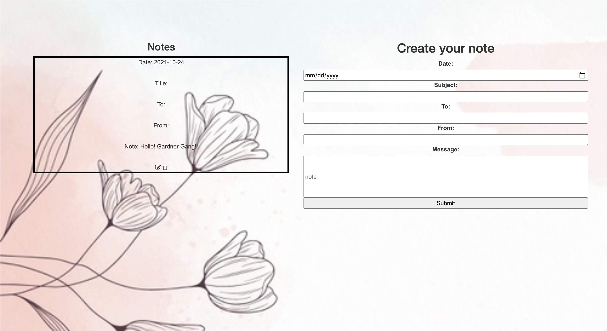

This is a full stack application where the user can write love and personal notes. The user can also read and edit created notes.

Link to Project: [https://juliedodev-lovenotes.netlify.app/]

How It's Made:

Tech Used: EJS, CSS, JavaScript, Node.js, Express.js and MongoDB

Optimizations: 

Lesson Learned: I learned how to use CRUD function and to operate stored data in MongoDB. 

